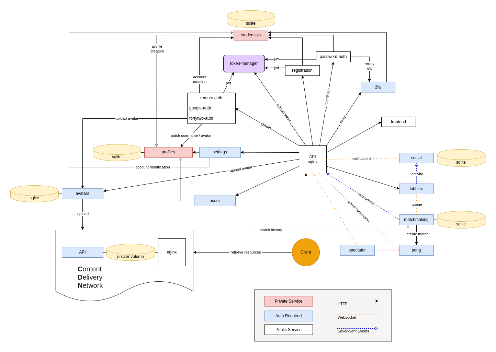

# [ft_transcendence - Yet Another Pong](https://github.com/YetAnotherTranscendenceTeam/ft_transcendence, "Goto Github repository")

This project is a web application offering a multiplayer online version of Atari's arcade game `Pong` (1972), integrated as modern video game plateform.

## Features

- Pong game
	- Local gameplay
	- Advanced 3D Graphics

- User account
	-	Remote authentication
		- Google Sign in
		- 42Intra
	- Two factor authentication
	- Unique username
	- Avatar upload

- Online gameplay
	- 1v1 / 2v2
	- Obstacles
	- Power-ups
		- Multiball
		- Magnet
		- Ice rink
	- Spectating mode

- Ranked games
	- Matchmaking rating
	- Matchmaking queue
	- Leaderboard

- Custom games
	- Points to win
	- Ball speed
	- Obscacles on/off
	- Power-ups selection

- Clashes
	- 3-16 teams competition
	- Dynamic tournament tree
	- All game modes
	- All game customizations
	- Confettis

- Social pannel
	- Friend system
	- Live activity status
	- Lobby invitations

- User profile
	- Game history
	- MMR evoluation graph
	- Game mode pie chart

# Setup

**This project requires the docker engine to be running, make sure you have it correctly setup before trying to deploy this project.**

Clone the project

```sh
git clone git@github.com:YetAnotherTranscendenceTeam/ft_transcendence.git
```

Navigate into it
```sh
cd ft_transcendence
```

## Development environment

This environment allows for easy modifications to the project, any modification to any file **that is not a module** will cause the dependant services to restart automatically.

Start the project

```sh
make dev
```

### Documentation 

In development mode, the API documentation is hosted at localhost http://localhost:42000

## Production environment

Setup your environment, you can use the environment generation tool with:

```sh
bash ./env-generator.sh <DOMAIN_NAME>
```

<!--
TODO: IMPROVE THIS!!!
-->
**You should tweak the .env file yourself with the corresponding parameters.** The [.env.template](./.env.template) file can help you understand what each variable corresponds to.

Start the project
```sh
make prod
```

## `.env` file configuration

A `.env` file is required at the projet's root, which should contain:

#### secrets `REQUIRED!`

```sh
PASSWORD_PEPPER="a-random-secret"
AUTHENTICATION_SECRET="a-random-secret"
REFRESH_TOKEN_SECRET="a-random-secret"
TOKEN_MANAGER_SECRET="a-random-secret"
CDN_SECRET="a-random-secret"
MATCHMAKING_SECRET="a-random-secret"
PONG_SECRET="a-random-secret"
MATCH_MANAGEMENT_SECRET="a-random-secret"
TWO_FA_SECRET="a-random-secret"
AUTH_2FA_SECRET="a-random-secret"
ACTIVITY_SSE_SECRET="a-random-secret"
SPECTATOR_SECRET="a-random-secret"
```
These variable are secret keys used for authentication across various services. Do not share them!

This shell command can be used to generate strong random secrets
```sh
echo $(openssl rand -base64  64 | tr -d '\n')
```

#### Deployment `REQUIRED!`

```sh
DOMAIN_NAME="the-domain-name-of-the-website"
BACKEND_URL="the-full-backend-url"
WS_URL="the-full-websocket-url"
FRONTEND_URL="the-full-frontend-url"
IMAGE_PREFIX="your-docker-hub-username"
```

if you are not planning on using `Docker Hub` to push and pull `Docker` images, `IMAGE_PREFIX` can be set to any string (ex: `prod`)

#### Remote clients

###### Google Sign In
```sh
GOOGLE_CLIENT_ID="your-google-client-id"
```

Visite the [Google Console](https://console.cloud.google.com/) to create your own client

###### 42 Intra
```sh
API42_CLIENT_ID="your-42api-client-id"
API42_SECRET="your-42api-secret"
API42_REDIRECT_URI="${BACKEND_URL}/auth/fortytwo/callback"
```

Visit the [42 Intranet ](https://profile.intra.42.fr/oauth/applications) to create your own client

## Microservice architecture



### API Nginx

This service is a webserver acting as the API gateway. Every request received is forwarded to the appropriate service based on the requested URL.

### Credentials

This service manages the account database, holding every account credentials secure on an internal network. Other services use it to validate an account creation or an authentication request from the client.

### Registration

This service handles password based account creation.

### Password-auth

This service handles authentication requests using a password based account.

### Google-auth

This service handles authentication requests using the Google Sign in.

### Fortytwo-auth

This service handles authentication requests using the Google Sign in.

### 2FA

This service handles multi authentication verification

### Token-manager

This service delivers and refresh `Json Web Tokens` to authenticated users, providing them a way to proove their identity to other services.

### Profiles

This service manages the profile database. Other services use it to resolve public profile information associated with an account.

### Settings

This service handles every account modification request, making sure requested changes are forwarded to the associated service.

### Avatars

This service handles users profile pictures, allowing them to retreive all pictures available to them and to upload custom ones.

### Social

This service handles users relationships. It broadcast live activity status to users friends and allow them to send/receive game invitations through notifications.

### Spectator

This service allows users to spectate online games.

### Matchmaking

This services handles matching lobbies with similar skill levels, it uses a custom rating to evaluate a player's skills. It also handles tournaments and automatically balances tournaments using player rating. The match history is also stored here. 

### Lobbies

This services allows player to play with their friends by inviting them to their lobby.
This is also the only entrypoint to the matchmaking queue.

### Pong

This is the game server, it receives game reservations from the matchmaking service, players connect here to play the game. It also sends the match results back to matchmaking to update the backend match entries and tournaments.

### CDN Nginx

This service is a webserver serving assets.

### CDN API

This service handles the `CDN` content. It allows other services to upload or delete ressources.
